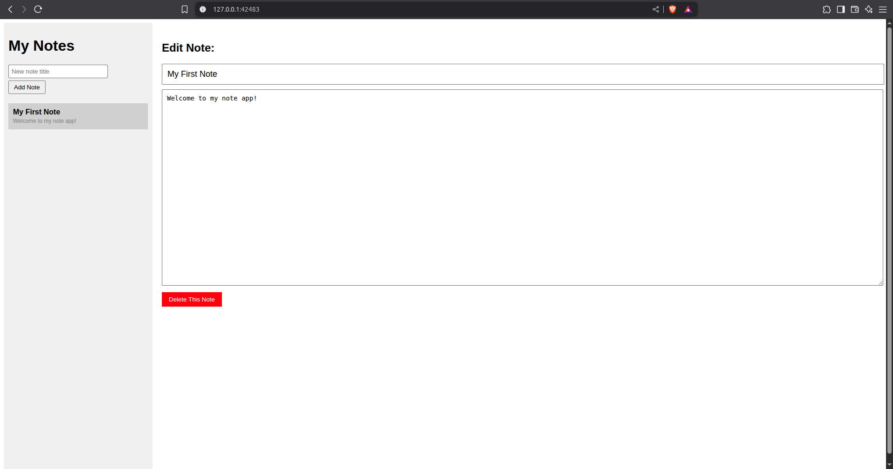

# My Note App

A simple note-taking app built with Rust and Dioxus. I made this to learn web development with Rust!

## Screenshot



## What it does

- Create new notes with titles
- Edit note titles and content
- Delete notes you don't need
- Click on notes in the sidebar to switch between them
- Auto-saves as you type

## How to run

Make sure you have Rust installed, then:

```bash
# Clone or download this project
cd note-app

# Install dependencies and run
cargo run
